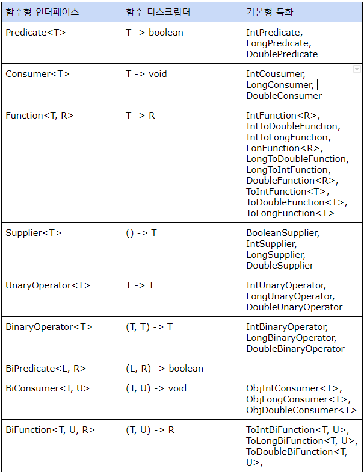

### 람다 표현식

람다 표현식(Lambda expression)은 메서드로 전달할 수 있는 익명 함수를 단순화한 것이라고 할 수 있다. 
람다 표현식에는 이름은 없지만, 파라미터 리스트, 바디, 반환 형식, 발생할 수 있는 예외 리스트는 가질 수 있다.

**람다의 특징**

- 익명 : 보통의 메서드와 달리 이름이 없으므로 익명이라 표현한다. 구현해야 할 코드에 대한 걱정거리가 줄어든다.
- 함수 : 람다는 메서드처럼 특정 클래스에 종속되지 않으므로 함수라고 부른다. 하지만 메서드처럼 파라미터 리스트, 바디, 반환 형식, 가능한 예외 리스트를 포함한다.
- 전달 : 람다 표현식을 메서드 인수로 전달하거나 변수로 저장할 수 있다.
- 간결성 : 익명 클래스처럼 많은 자질구레한 코드를 구현할 필요가 없다.

예)
```java
Comparator<Apple> byWeights = (Apple a1, Apple a2) -> 
    a1.getWeight().compareTo(a2.getWeight());
```

람다는 세 부분으로 이루어진다.

- 파라미터 리스트 : Comparator의 compare메서드의 파라미터(두 개의 사과)
- 화살표 : 화살표(->)는 람다의 파라미터 리스트와 바디를 구분한다.
- 람다의 바디 : 두 사과의 무게를 비교한다. 람다의 반환값에 해당하는 표현식이다.

다음은 람다의 기본 문법이다.
(parameters) -> expression

또는 다음처럼 표현도 가능하다. (중괄호 이용)
(parameters) -> { statements; }

함수형 인터페이스의 추상 메서드는 람다 표현식의 시그니처를 묘사한다. 함수형 인터페이스의 메서드 시그니처를 함수 디스크립터(function descriptor)라고 한다.

자바 8의 대표적인 함수형 인터페이스



**예외, 람다, 함수형 인터페이스의 관계**

함수형 인터페이스는 확인된 예외를 던지는 동작을 허용하지 않는다. 즉, 예외를 던지는 람다 표현식을 만들려면 확인된 예외를 선언하는 함수형 인터페이스를 직접 정의하거나 람다를 try-catch 블록으로 감싸야 한다.

**형식 검사**

람다가 사용되는 콘텍스트를 이용해서 람다의 형식을 추론할 수 있다. 어떤 콘텍스트(예를 들면 람다가 전달될 메서드 파라미터나 람다가 할당되는 변수 등)에서 기대되는 람다 표현식의 형식을 **대상 형식(target type)** 이라고 부른다.

형식 검사의 경우, 함수형 인터페이스만 가능하다. 예를 들어 Object라든지 함수형 인터페이스로 선언되지 않은 인터페이스는 형식 검사가 불가능하다.

**형식 추론**

자바 컴파일러는 람다 표현식이 사용된 콘텍스트(대상 형식)를 이용해서 람다 표현식과 관련된 함수형 인터페이스를 추론한다. 즉, 대상 형식을 이용해서 함수 디스크립터를 알 수 있으므로 컴파일러는 람다의 시그니처도 추론할 수 있다. 
결과적으로 컴파일러는 람다 표현식의 파라미터 형식에 접근할 수 있으므로 람다 문법에서 이를 생략할 수 있다.

즉, 자바 컴파일러는 다음처럼 람다 파라미터 형식을 추론할 수 있다.

```java
List<Apple> whiteApples = filter(inventory, a -> "green".equals(a.getColor()));
```

파라미터 a에는 형식을 명시적으로 지정하지 않았다. 그럼에도 불구하고 Apple 클래스에 접근하여 getColor()메서드를 호출했다.

여러 파라미터를 포함하는 람다 표현식에는 코드 가독성 향상이 더욱 두드러진다. 

```java
Comparator<Apple> c = (Apple a1, Apple a2) -> a1.getWeight().compareTo(a2.getWeight()); 형식을 추론하지 않은 코드

Comparator<Apple> c1 = (a1, a2) -> a1.getWeight().compareTo(a2.getWeight()); 형식을 추론한 코드
```

**지역 변수 사용**

람다 표현식에서는 익명 함수가 하는 것처럼 자유 변수(파라미터로 넘겨진 변수가 아닌 외부에서 정의된 변수)를 활용할 수 있다. 이와 같은 동작을 람다 캡쳐링(capturing lambda)이라고 부른다.

```java
int portNumber = 1337;
Runnable r = () -> System.out.println(portNumber);
```

자유 변수에도 약간의 제약이 있는데, 람다는 인스턴스 변수와 정적 변수를 자유롭게 캡쳐(자신의 바디에서 참조할 수 있도록)할 수 있다. 
하지만 그러려면 지역 변수는 명시적으로 final로 선언되어 있거나, 실질적으로 final로 선언된 변수와 똑같이 사용되어야 한다. 그렇지 않으면 에러를 발생시킨다. 
즉, 람다 표현식은 한 번만 할당할 수 있는 지역 변수를 캡쳐할 수 있다.(인스턴스 변수 캡쳐는 final 지역 변수 this를 캡쳐하는 것과 마찬가지이다.)

**메서드 레퍼런스**

메서드 레퍼런스를 이용하면 기존의 메서드 정의를 재활용해서 람다처럼 전달할 수 있다. 때로는 람다 표현식보다 메서드 레퍼런스를 사용하는 것이 더 가독성이 좋으며 자연스러울 수 있다.

다음은 기존 코드이다.
```java
inventory.sort((Apple a1, Apple a2) -> a1.getWeight().compareTo(a2.getWeight()));
```

다음은 메서드 레퍼런스와 java.util.Comparator.comparing()을 활용한 코드이다.

```java
inventory.sort(comparing(Apple::getWeight));
```

메서드 레퍼런스는 특정 메서드만을 호출하는 람다의 축약형이라고 볼 수 있다. 
예를 들어 람다가 ‘이 메서드를 직접 호출해’라고 명령한다면 메서드를 어떻게 호출해야 하는지 설명을 참조하기보다는 메서드명을 직접 참조하는 것이 편리하다. 
실제로 메서드 레퍼런스를 이용하면 기존 메서드 구현으로 람다 표현식을 만들 수 있다. 
이때 명시적으로 메서드명을 참조함으로써 가독성을 높일 수 있다. 메서드 레퍼런스는 메서드명 앞에 구분자(::)를 붙이는 방식으로 활용한다.

```java

(Apple a) -> a.getWeight()을 Apple::getWeight

() -> Thread.currentThread().dumpStack()을 Thread.currentThread()::dumpStack

(str, i) -> str.substring(i)를 String::substring

(String s) -> System.out.println(s)를 System.out::println
```

메서드 레퍼런스는 세 가지 유형으로 구분할 수 있다.

- **정적 메서드 레퍼런스** : 예를 들어 Integer의 parseInt 메서드는 Integer.parseInt로 표현할 수 있다.
- **다양한 형식의 인스턴스 메서드 레퍼런스** : 예를 들어 String의 length 메서드는 String::length로 표현할 수 있다.
- **기존 객체의 인스턴스 메서드 레퍼런스** : 예를 들어 Transaction 객체를 할당받은 expensiveTransaction 지역 변수가 있고, Transaction 객체에는 getValue 메서드가 있다면, 
이를 expensiveTransaction::getValue로 표현이 가능하다.

추가로 생성자 레퍼런스도 있다.

ClassName::new 처럼 클래스명과 new 키워드를 이용해서 기존 생성자의 레퍼런스를 만들 수 있다. 
단, 예외적으로 기본 생성자가 클래스에 없다면 에러를 발생시킨다.

